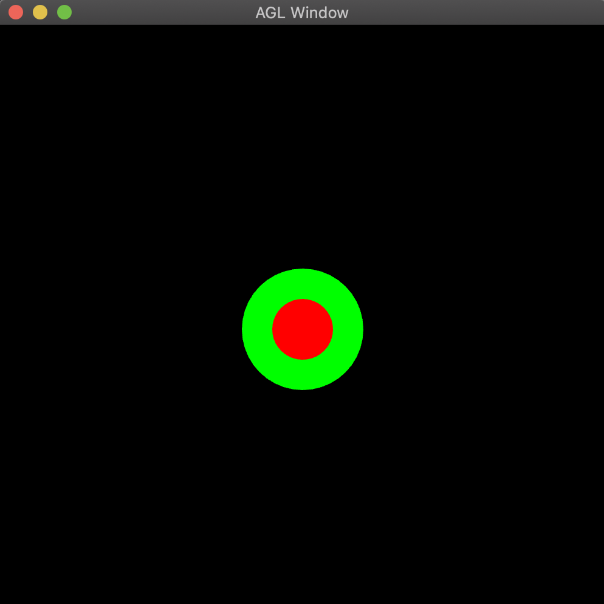

# Readme

## Sphere2D

There are two 2d spheres one in front of the other. They have the same (x,y) coordinates but different z coordinates. 

## Sphere3D

![] (http://g.recordit.co/ltJARRxSn6.gif)
The sphere moves in a random direction when the Space-bar is pressed, and resets to the center when R is pressed. 
