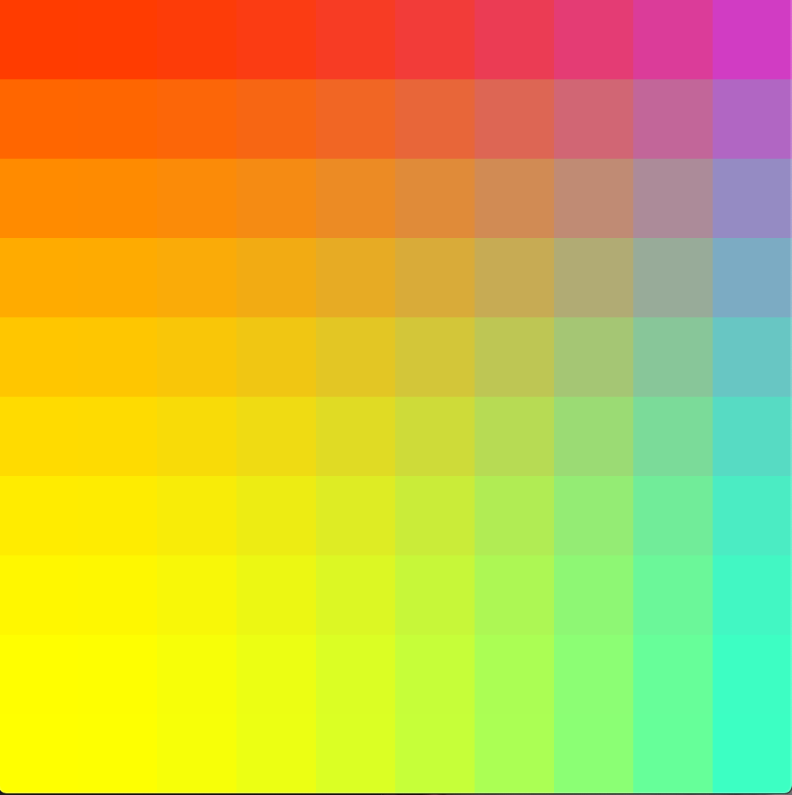

# Readme

## Gradient
Equally sized cubes across the screen with interpolating colors.  

## Curves
Draw curves using Bernstein when "1" key is pressed, and using interpolation when "2" key is pressed.  

## Particle
Move a particle along a curve, and wrap it around when it goes through the curve.  

## Screensaver pt. 1
Interpolating curves  

## Screensaver pt.2 
Screensaver with trailing effect. 

